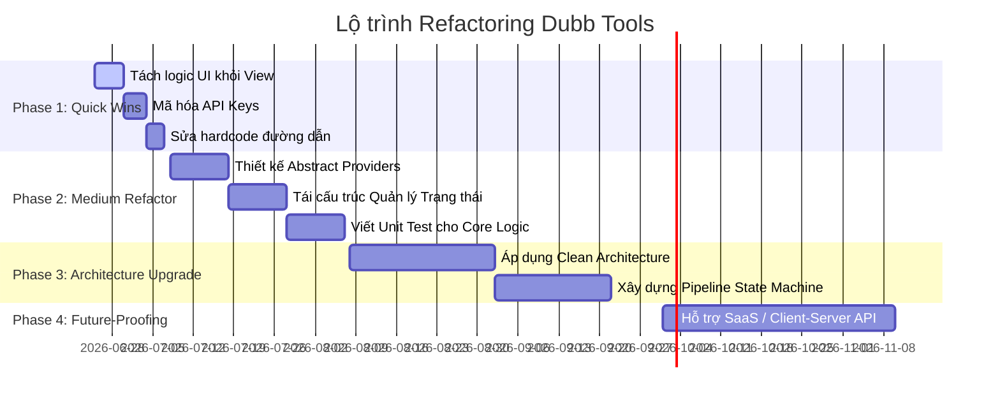

# Báo Cáo Đánh Giá Kiến Trúc (Architecture Review) - Dự Án Dubb Tools

Báo cáo này thực hiện một cuộc đánh giá toàn diện về mặt kiến trúc phần mềm cho dự án desktop lồng tiếng video tự động (Dubb Tools) viết bằng Python + Flet.

---

## Executive Summary

Hệ thống hiện tại là một ứng dụng Python Flet được thiết kế theo cấu trúc ba lớp đơn giản: UI (Features) -> Services -> Utils/Processors. Hệ thống có thế mạnh lớn về mặt thực tế sử dụng (cho phép chạy từng bước hoặc chạy toàn bộ pipeline) nhưng có nhiều điểm hạn chế về mặt ghép nối (coupling), quản lý trạng thái, và phân chia ranh giới giữa các lớp.

### Bảng Điểm Kiến Trúc (Architecture Scorecard)

| Chỉ số | Điểm | Đánh giá tổng quan |
| :--- | :--- | :--- |
| **Kiến trúc Tổng thể (Architecture Score)** | **6.5 / 10** | Cấu trúc phân tách cơ bản ổn nhưng ranh giới giữa UI, Service và Business Logic còn mờ nhạt. |
| **Khả năng Bảo trì (Maintainability)** | **5.5 / 10** | Các file View/Feature quá lớn (ví dụ `pipeline_view.py` >1000 dòng), chứa nhiều logic xử lý trạng thái và File I/O. |
| **Khả năng Mở rộng (Extensibility)** | **6.0 / 10** | Việc thêm provider dịch thuật/TTS mới yêu cầu sửa trực tiếp vào mã nguồn mà chưa có Cơ chế Plugin/Provider Registry hoàn chỉnh. |
| **Độ tin cậy & Ổn định (Reliability)** | **6.5 / 10** | Đã có cơ chế retry/resume cơ bản và bắt ngoại lệ ở các bước, tuy nhiên thiếu cơ chế rollback/cleanup triệt để khi crash giữa chừng. |
| **Khả năng Mở rộng Quy mô (Scalability)** | **5.0 / 10** | Kiến trúc đa luồng dựa trên Python Threading bị giới hạn bởi GIL và I/O block, chưa sẵn sàng để chuyển dịch thành SaaS hoặc client-server. |

---

## Top 20 Issues

Dưới đây là 20 vấn đề kiến trúc hàng đầu được phát hiện trong mã nguồn hiện tại:

| STT | Vấn đề phát hiện (Issue) | Mức độ nghiêm trọng | Tác động (Impact) | Công sức sửa (Effort) | Khuyến nghị giải pháp (Recommendation) |
| :--- | :--- | :--- | :--- | :--- | :--- |
| 1 | **Tích hợp logic nghiệp vụ vào UI** (`pipeline_view.py`, `tts_view.py`) | Cao | Khó viết unit test cho UI, code view phình to, vi phạm quy tắc Single Responsibility. | Trung bình | Tách toàn bộ logic nghiệp vụ (nhập/xuất file, validate) sang Lớp Application/Service. Áp dụng mô hình MVP (Model-View-Presenter) hoặc BLoC cho Flet. |
| 2 | **Các file view UI quá lớn** (`pipeline_view.py` > 1200 dòng) | Cao | Khó đọc hiểu, dễ xung đột code khi làm việc nhóm, bảo trì rất khó khăn. | Trung bình | Chia nhỏ view thành các Sub-Component độc lập (ví dụ: `StepConfigCard`, `ProgressCard`, `ResultListRow`). |
| 3 | **Lưu trữ API Keys trong cấu hình phẳng dạng Cleartext** (`tts_config.json`, `pipeline_config.json`) | Rất cao | Rò rỉ thông tin nhạy cảm của người dùng khi tệp cấu hình bị đọc trộm. | Thấp | Mã hóa API keys trước khi lưu xuống ổ đĩa bằng thư viện mã hóa đối xứng (như `cryptography`) hoặc sử dụng OS Keyring (như `keyring`). |
| 4 | **Thiếu Abstraction Interface (Lớp Trừu Tượng) cho Providers** | Cao | Khó thêm các TTS/Translation provider mới nếu không sửa đổi mã nguồn chính. | Trung bình | Định nghĩa các `BaseTTSProvider` và `BaseTranslator` bằng thư viện `abc` trong Python để áp dụng Strategy Pattern. |
| 5 | **Không có Provider Registry/Factory** | Trung bình | Phải dùng cấu trúc `if-else` lặp đi lặp lại để khởi tạo provider. | Thấp | Triển khai Registry Pattern để đăng ký tự động các provider và dùng Factory Class để sinh thực thể. |
| 6 | **Blocking UI Thread do xử lý I/O nặng** | Cao | Giao diện bị đơ/lag tạm thời khi xử lý video hoặc tải file dung lượng lớn. | Trung bình | Sử dụng mô hình bất đồng bộ (`asyncio`) thay vì Threading thuần túy cho các tác vụ I/O, chạy các sub-process lồng tiếng ở các worker riêng biệt. |
| 7 | **Quản lý tài nguyên tạm thời lỏng lẻo** (`shutil.rmtree`) | Trung bình | Để lại tệp tin rác hoặc xóa nhầm dữ liệu người dùng nếu luồng bị crash bất ngờ. | Trung bình | Áp dụng Context Manager (`with`) kết hợp lớp quản lý file tạm (`tempfile.TemporaryDirectory`) được quản lý vòng đời chặt chẽ. |
| 8 | **Đường dẫn cứng (Hardcoded Paths)** khắp nơi | Trung bình | Ứng dụng hoạt động không ổn định khi đóng gói thành file exe/app hoặc chạy trên HĐH khác. | Thấp | Tập trung hóa tất cả các đường dẫn tài nguyên tĩnh và thư mục làm việc vào một class/module cấu hình đường dẫn duy nhất. |
| 9 | **Thiếu cơ chế Checkpoint/Rollback trạng thái chi tiết** cho Pipeline | Cao | Không thể khôi phục lại trạng thái chính xác của các phân đoạn đã tạo trước đó khi pipeline lỗi ở bước cuối. | Trung bình | Triển khai State Machine lưu trạng thái các bước và hash của file trung gian xuống một CSDL nhúng cục bộ (như SQLite). |
| 10 | **Phụ thuộc trực tiếp vào Module Python bên ngoài thay vì Interface** | Trung bình | Khó mock up khi viết unit test. | Trung bình | Áp dụng Dependency Injection (DI) để truyền các dịch vụ và provider vào các View/Service qua hàm khởi tạo. |
| 11 | **Bẫy lỗi chung chung (`except Exception as exc`)** | Trung bình | Nuốt mất lỗi gốc (root cause), gây khó khăn khi debug các lỗi phức tạp của thư viện liên quan đến C. | Thấp | Bắt các exception chuyên biệt (như `FileNotFoundError`, `SubprocessError`) trước khi dùng Exception chung và ghi lại Stack Trace đầy đủ. |
| 12 | **Thiếu cơ chế Ghi nhật ký cấu trúc (Structured Logging)** | Trung bình | Rất khó phân tích hành vi lỗi của ứng dụng từ tệp nhật ký của người dùng cuối. | Thấp | Tích hợp hệ thống logging chuẩn (`logging` module) với định dạng JSON hoặc text có cấu trúc, bao gồm Job ID và Step ID. |
| 13 | **Kiểm thử tự động (Unit/Integration Test) gần như bằng không** | Cao | Dễ phát sinh bug hồi quy (regression) khi cập nhật các thư viện AI nặng như Whisper hay ONNX. | Cao | Thiết lập cấu trúc kiểm thử với `pytest`, viết mock cho các API bên thứ ba và các tác vụ CLI. |
| 14 | **Gọi trực tiếp subprocess mà không quản lý vòng đời** | Cao | Tạo ra các tiến trình mồ côi (zombie processes) khi người dùng bấm nút Dừng (Stop) trên UI. | Trung bình | Đóng gói tất cả các cuộc gọi subprocess trong một trình quản lý tiến trình có khả năng kill tree/kill group. |
| 15 | **Không có cơ chế di chuyển cài đặt (Settings Migration)** | Thấp | Ứng dụng bị lỗi hoặc crash khi người dùng nâng cấp phiên bản mới có cấu trúc JSON cấu hình thay đổi. | Thấp | Thêm trường `"version"` vào file config JSON và viết các hàm migration tự động chạy khi khởi động ứng dụng. |
| 16 | **Kiến trúc phụ thuộc chặt chẽ vào Python GIL** | Cao | Xử lý đa luồng TTS song song có hiệu năng không tối ưu nếu provider thực thi code CPU-bound trong Python. | Trung bình | Sử dụng `ProcessPoolExecutor` thay thế cho `ThreadPoolExecutor` cho các tác vụ CPU-bound. |
| 17 | **Thiếu cơ chế Auto-Update bảo mật** | Cao | Người dùng cuối sử dụng phiên bản lỗi thời mà không biết, gây rò rỉ API key hoặc lỗi API bên thứ ba. | Cao | Xây dựng cơ chế cập nhật tự động bằng cách kiểm tra GitHub Releases API và tải bản cập nhật đóng gói sẵn. |
| 18 | **Thiếu giới hạn tài nguyên và hàng đợi tác vụ (Job Queue)** | Trung bình | Hệ thống bị tràn RAM hoặc CPU khi người dùng cố chạy nhiều tiến trình ghép nối cùng lúc. | Trung bình | Triển khai kiến trúc Single Active Job với hàng đợi (Queue) quản lý thứ tự thực thi. |
| 19 | **Sử dụng trực tiếp CLI/Thư viện ngoài không có Sandbox bảo vệ** | Trung bình | Lỗi bảo mật leo thang đặc quyền nếu file đầu vào chứa mã độc hại khai thác lỗ hổng FFmpeg hoặc MoviePy. | Cao | Validate định dạng file đầu vào chặt chẽ và cô lập các tác vụ CLI nặng trong môi trường con ít quyền nhất có thể. |
| 20 | **Không phân rõ Môi trường Phát triển/Sản xuất** | Thấp | Khó cấu hình mock/API kiểm thử, dễ ghi đè dữ liệu thật trong quá trình phát triển. | Thấp | Sử dụng các biến môi trường để xác định chế độ phát triển (Development) hay sản xuất (Production). |

---

## Technical Debt Report

Mã nguồn hiện tại đang gánh chịu một số khoản nợ kỹ thuật (Technical Debt) cần xử lý sớm để tránh tắc nghẽn phát triển:

*   **UI-Coupled State Management**: Trạng thái của pipeline và kết quả công việc đang được lưu trực tiếp trên các thuộc tính của View (`self._segments`, `self._progress_value`). Nếu người dùng chuyển tab điều hướng (NavigationRail), toàn bộ giao diện Render lại và có nguy cơ mất trạng thái nếu không được quản lý cẩn thận thông qua Service hoặc Store tập trung.
*   **Thiếu Unit Tests**: Không có tệp tin test nào trong thư mục dự án. Bất kỳ thay đổi nào trong `tts_service.py` hay `pipeline_orchestrator.py` đều phải kiểm thử thủ công bằng mắt.
*   **Duplicate I/O Logic**: Việc kiểm tra file tồn tại, validate, tính toán thời lượng (`get_duration`) đang nằm rải rác ở cả `utils` và `services`.
*   **Đóng gói Vendor thô sơ**: Việc tự động clone dự án `pyvideotrans` khi khởi chạy bằng Git subprocess hoặc tải file Zip dễ bị lỗi do môi trường mạng hoặc cấu hình Git cục bộ của người dùng cuối.

---

## Architecture Risks

1.  **Rủi ro từ Vendor Phụ thuộc (Vendor Lock-in & Drift)**: Việc clone trực tiếp nhánh `main` của `pyvideotrans` khiến ứng dụng có thể bị crash bất cứ lúc nào nếu repository đó có các thay đổi lớn (breaking changes) về cấu trúc thư mục hoặc tên hàm.
2.  **Rò rỉ Khóa bí mật (Secret Leakage)**: Tệp cấu hình lưu trữ API Keys dạng cleartext nằm ngay trong thư mục ứng dụng dễ bị sync lên Cloud hoặc bị đánh cắp bởi mã độc chạy cục bộ.
3.  **Hạn chế Đóng gói (PyInstaller/Nuitka Packaging)**: sherpa-onnx, faster-whisper, moviepy chứa các thư viện liên kết động (.dll, .so) rất nặng và các model AI nhị phân. Việc đóng gói ứng dụng Flet thành một file chạy duy nhất gặp rủi ro thiếu thư viện động rất cao nếu kiến trúc nạp vendor không được module hóa sạch sẽ.

---

## Refactoring Roadmap



### Phase 1 - Quick Wins (1-2 tuần)
*   **Mục tiêu**: Giải quyết các vấn đề cấp bách về code smell, bảo mật khóa và dọn dẹp view UI.
*   **Công việc cụ thể**:
    1.  Tách các khối hàm I/O và logic tính toán ra khỏi `tts_view.py` và `pipeline_view.py`.
    2.  Triển khai mã hóa API Keys bằng giải pháp lưu trữ an toàn.
    3.  Tổ chức lại toàn bộ đường dẫn làm việc (`working_directory`) vào một module quản lý tài nguyên tập trung.

### Phase 2 - Medium Refactor (1 tháng)
*   **Mục tiêu**: Nâng cao tính khả thử (testability) và tính khả mở (extensibility) của hệ thống.
*   **Công việc cụ thể**:
    1.  Viết các Interface `BaseTTSProvider` và `BaseTranslator`.
    2.  Chuyển đổi EdgeTTS và GeminiTTS thành các class cụ thể kế thừa từ Interface.
    3.  Thiết lập bộ khung unit test với `pytest` và kiểm thử tự động các module STT, Translate, TTS mà không cần chạy UI.

### Phase 3 - Architecture Upgrade (2-3 tháng)
*   **Mục tiêu**: Tái cấu trúc ứng dụng theo Clean Architecture và củng cố độ tin cậy của Pipeline.
*   **Công việc cụ thể**:
    1.  Tách cấu trúc thành các lớp Domain, Application, Infrastructure.
    2.  Xây dựng Pipeline State Machine ghi trạng thái xuống SQLite cục bộ để hỗ trợ resume/rollback hoàn hảo.
    3.  Chuyển đổi luồng I/O đồng bộ sang Asyncio để UI Flet hoàn toàn mượt mà.

### Phase 4 - Future-Proofing (6-12 tháng)
*   **Mục tiêu**: Sẵn sàng chuyển đổi mô hình kinh doanh SaaS và đa người dùng.
*   **Công việc cụ thể**:
    1.  Tách rời phần công cụ lõi (Core Engine) thành một dịch vụ độc lập giao tiếp qua REST API/gRPC.
    2.  Thay thế Flet UI bằng Client App (Web/React hoặc Flutter native) kết nối với Cloud Backend xử lý GPU.

---

## Proposed Target Architecture

Để chuẩn bị cho khả năng mở rộng lâu dài, cấu trúc thư mục của dự án nên được sắp xếp lại theo hướng **Clean Architecture** kết hợp **Hexagonal Architecture (Ports and Adapters)**:

```text
dubb-tools/
├── app/                        # Lớp Application (Ứng dụng Flet UI & Controllers)
│   ├── ui/                     # Giao diện người dùng
│   │   ├── components/         # Các Widget dùng chung (Slider, Dropdown, RowKếtQuả)
│   │   ├── features/           # Các màn hình chức năng chính (View)
│   │   └── shell.py            # Khung điều hướng ứng dụng chính
│   └── presenter/              # Điều phối luồng và cập nhật trạng thái UI (BLoC / Controller)
│
├── core/                       # Lớp Domain & Application Core (Độc lập với Flet và Vendor)
│   ├── domain/                 # Thực thể nghiệp vụ thuần túy (Pure Entities)
│   │   ├── models.py           # Segment, GeneratedSegment, PipelineConfig, JobContext
│   │   └── exceptions.py       # Định nghĩa lỗi nghiệp vụ
│   │
│   ├── ports/                  # Định nghĩa Interfaces/Contracts (Ports)
│   │   ├── tts.py              # Interface BaseTTSProvider
│   │   ├── translator.py       # Interface BaseTranslator
│   │   └── pipeline.py         # Interface BasePipelineStep
│   │
│   └── use_cases/              # Logic xử lý quy trình nghiệp vụ (Business Rules)
│       ├── run_tts_job.py      # Use-case chạy TTS
│       ├── run_translation.py  # Use-case dịch thuật
│       └── pipeline_engine.py  # Công cụ chạy Pipeline State Machine
│
├── infrastructure/             # Lớp Infrastructure (Adapters giao tiếp hệ thống, API, Thư viện ngoài)
│   ├── database/               # Quản lý lưu trữ trạng thái (SQLite/JSON)
│   ├── providers/              # Implementations của các Ports
│   │   ├── tts/                # EdgeTTSAdapter, GeminiTTSAdapter
│   │   ├── translator/         # GeminiTranslatorAdapter, OpenAITranslatorAdapter
│   │   └── stt/                # FasterWhisperSTTAdapter
│   │
│   └── external/               # Các wrapper công cụ dòng lệnh (FFmpeg, yt-dlp)
│
├── config/                     # File cấu hình ứng dụng cục bộ
├── resources/                  # Tài nguyên tĩnh, mô hình AI nhị phân
├── tests/                      # Kịch bản kiểm thử tự động
│   ├── unit/                   # Unit test cho logic core
│   └── integration/            # Test tích hợp luồng dịch vụ
│
├── main.py                     # Entrypoint khởi tạo ứng dụng & Bootstrap DI Container
└── requirements.txt            # Quản lý phụ thuộc
```

### Giải thích lý do cho sự thay đổi cấu trúc này:
1.  **Độc lập Công nghệ**: Logic lõi của ứng dụng (trong `core/`) hoàn toàn không phụ thuộc vào Flet. Bạn có thể dễ dàng viết một ứng dụng CLI chạy bằng cách import `core/use_cases/` hoặc dựng một Web server FastAPI mà không phải sửa một dòng code nghiệp vụ nào.
2.  **Dễ dàng thay đổi Provider (Extensibility)**: Thêm một engine dịch thuật hoặc TTS mới chỉ đơn giản là tạo một Adapter mới trong `infrastructure/providers/` kế thừa đúng Interface trong `core/ports/` và đăng ký nó với hệ thống.
3.  **Khả năng Kiểm thử Vượt trội (Mockability)**: Khi viết unit test, bạn có thể dễ dàng mock các adapter trong `infrastructure/` để kiểm thử logic phức tạp của `use_cases` mà không lo tốn tiền gọi API thật hay yêu cầu GPU cấu hình mạnh để chạy mô hình AI.

---

## Final Recommendation

Nếu là Tech Lead của dự án này, tôi sẽ đưa ra các quyết định hành động như sau:

### 1. Những phần tôi sẽ GIỮ LẠI
*   **Flet UI Framework**: Giữ lại để phát triển bản Desktop đơn lẻ. Flet rất tốt cho việc phát triển giao diện nhanh (rapid prototyping) bằng Python, đặc biệt là khi đội ngũ phát triển mạnh về ngôn ngữ này.
*   **Sherpa-ONNX & Faster-Whisper**: Hai công cụ này xử lý tách tiếng và STT offline rất hiệu quả về cả mặt tốc độ lẫn tài nguyên sử dụng, phù hợp tối đa cho ứng dụng chạy cục bộ (Edge computing).
*   **Chia luồng xử lý TTS song song**: Cơ chế ThreadPoolExecutor chạy đa luồng cho TTS hiện tại chạy rất tốt và mang lại hiệu suất vượt trội, cần tiếp tục phát huy và mở rộng.

### 2. Những phần tôi sẽ REFACTOR (Tái cấu trúc)
*   **Tách logic nghiệp vụ ra khỏi UI**: Thực hiện ngay lập tức. Chuyển toàn bộ code điều phối file, tính toán thời gian, ghi đĩa sang các module dịch vụ độc lập. View chỉ làm nhiệm vụ hiển thị và gửi tín hiệu sự kiện (Event).
*   **Hệ thống cấu hình & API Keys**: Chuyển sang lưu trữ API Keys an toàn qua hệ thống Keyring của Hệ điều hành thay vì ghi trực tiếp dạng cleartext ra file JSON.
*   **Quản lý tiến trình con**: Refactor lại cách gọi các chương trình dòng lệnh ngoài (FFmpeg, yt-dlp) thông qua các class wrapper an toàn hơn, có kiểm soát đầu ra (stdout/stderr) và dọn dẹp tài nguyên chặt chẽ khi bị hủy ngang.

### 3. Những phần tôi sẽ VIẾT LẠI TỪ ĐẦU
*   **Pipeline Orchestrator**: Thay thế file script tuần tự hiện tại bằng một **Pipeline State Machine** thực thụ sử dụng mô hình sự kiện (Event-driven). Có cơ chế lưu dấu vết (checkpoint) và khôi phục trạng thái (resume) hoàn chỉnh xuống SQLite.
*   **Cơ chế Tích hợp Nhà cung cấp (Provider Integration)**: Viết lại kiến trúc nạp provider bằng cách sử dụng các Interface trừu tượng kế thừa lớp `abc` của Python và mẫu thiết kế Factory Pattern. Loại bỏ hoàn toàn các chuỗi lệnh `if-else` kiểm tra loại provider dài dòng.
*   **Cơ chế Đóng gói và Bootstrap Vendor**: Thay vì clone cả repository `pyvideotrans` từ git khi runtime, tôi sẽ đóng gói các file script phụ thuộc cần thiết trực tiếp vào gói phân phối ứng dụng và chỉ tải về các file mô hình AI lớn (.onnx) khi người dùng yêu cầu, giúp giảm thiểu rủi ro lỗi mạng và tăng trải nghiệm khởi động ứng dụng lần đầu.
